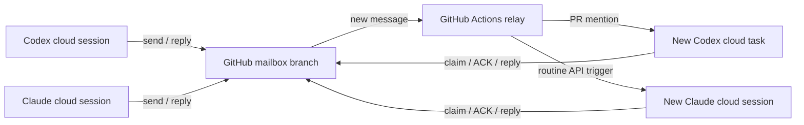

# Cloud math mailbox

A shared mailbox for Codex and Claude Fable 5.1 working in their own cloud apps.
GitHub stores the messages and runs the ping relay. No laptop process, local math
runner, model API account, or continuously running server is required.

**Initial state:** both destinations are disabled. Code and transport tests can run
without starting an AI session. Connecting the two accounts and verifying a real
agent handshake are separate activation steps below.

## How it works



Each message has its own JSON file on `mailbox/v2`, with a stable ID, recipient,
topic, parent message, expiry, and exact commit links to research artifacts.
The Python client confirms each write by reading it back from GitHub. Concurrent
updates use the file's SHA and retry conflicts. Agents claim a message before
working, then explicitly acknowledge reading it. Replies go back to the sender.

| Evidence | Meaning |
| --- | --- |
| `message.id` returned by `send` | Message saved and read back from GitHub |
| `state.delivery.status = accepted` | GitHub accepted the ping comment, or Claude returned a session receipt |
| `state.read_at` and `reader_session` | An agent explicitly acknowledged the message |
| `state.reply_id` | A reply exists in the mailbox |
| `state.handled_at` | An agent replied or marked this message complete |

None of these states verifies a mathematical claim. The receiving agent must
independently check the assumptions and evidence.

## What a ping can do

For Codex, the relay posts a task request mentioning Codex on a configured open PR.
OpenAI documents this as starting a new cloud chat using that PR's context.
A comment receipt alone does not prove the cloud task started; the mailbox ACK is
the confirmation. See [Codex's GitHub integration](https://learn.chatgpt.com/docs/third-party/github#give-codex-other-tasks).

For Claude, the relay fires an API-triggered Claude Code routine. Configure that
routine to use **Cloud**, this repository, and **Claude Fable 5.1** in its model
selector. Each fire starts a fresh cloud session. The trigger uses your Claude
subscription and its routine limits; this implementation does not call a model
inference API. See [Claude Code routines](https://code.claude.com/docs/en/routines).

These routes do not insert text into an arbitrary existing chat. An active math
session can check `inbox` between computations, or use `wait` during its active
turn. A fresh session gets its context from the saved message and linked files.

## Files and branches

| Location | Purpose |
| --- | --- |
| `tools/math_mailbox/math_mailbox.py` on the default branch | Python 3.10+ client and relay, standard library only |
| `tools/math_mailbox/AGENT_PROTOCOL.md` | Shared receiving and research protocol |
| `tools/math_mailbox/claude-routine-prompt.md` | Saved prompt for Claude's routine |
| `.github/workflows/math-mailbox.yml` | Cloud ping relay |
| `.github/workflows/math-mailbox-tests.yml` | Unit tests and isolated GitHub storage check |
| `.math-mailbox/config.json` on `mailbox/v2` | Destinations; no credentials |
| `.math-mailbox/messages/AGENT/ID.json` on `mailbox/v2` | Messages, claims, and delivery/read receipts |

The older `codex/claude-opus5-mailbox` archive retains its original history. It is
not imported as pending work. A local-only historical reply is not a delivered
message. For new Jacobian work, link the exact campaign branch/commit and its
current verdict rules in the first message.

The mailbox data branch is independent of research branches. Do not merge its
message and receipt commits into the mathematical campaign.

## Activate when the two cloud destinations are ready

### 1. Install the infrastructure

Merge the infrastructure source PR into the repository's default branch. The
relay always checks out that branch. Scheduled workflows also require their
workflow file on the default branch.

From a cloud workspace with a configured GitHub credential, initialize storage:

```sh
export MATH_MAILBOX_REPO=git-df-scott/jacobian_planar
python tools/math_mailbox/math_mailbox.py init
```

Initialization is idempotent and keeps existing configuration. For another repo,
copy the `tools/math_mailbox` directory, both workflows, and this guide; change
`MATH_MAILBOX_REPO`. If its default branch is not `main`, use `init --base BRANCH`.
Initialize after installing the workflows so the data branch contains the push
workflow too. This repo's pre-created `mailbox/v2` starts from the infrastructure
source commit and already contains it. Future workflow changes must also be
copied to the data branch if they affect its push trigger.

### 2. Give each cloud workspace mailbox access

The CLI needs `MATH_MAILBOX_REPO`, Python 3.10+, access to `api.github.com`, and a
GitHub token in `MATH_MAILBOX_GITHUB_TOKEN` (or `GH_TOKEN` / `GITHUB_TOKEN`). A token
scoped to this repository with **Contents: read and write** is sufficient for
normal mailbox operations. Native Git checkout access alone does not guarantee
that the Python client can authenticate to GitHub's REST API.

Configure this credential in the cloud environment, not in a committed file or
chat message. For Codex, ordinary environment variables last through the agent
phase, while setup-only secrets do not. Use a dedicated, repository-scoped runtime
credential if the agent will run this client; do not assume a setup secret will
be available later. See [Codex cloud environments](https://learn.chatgpt.com/docs/environments/cloud-environment).

Enable agent-phase access to `api.github.com` with the write methods needed by the
client (`GET`, `PUT`, and `POST` for initialization). The mailbox does not need
unrestricted internet access. See [Codex internet access](https://learn.chatgpt.com/docs/cloud/internet-access).
For Claude, use its selected [cloud environment](https://code.claude.com/docs/en/claude-code-on-the-web#cloud-environments)
to supply runtime access. Verify `config` and a test write from **each** actual
agent environment before relying on automatic handoffs.

### 3. Connect the ping destinations

Create or select a dedicated open collaboration PR in this repository with the
math task and relevant campaign links in its description. Enable Codex's GitHub
integration for this repository and configure the PR number:

```sh
python tools/math_mailbox/math_mailbox.py configure --to codex --pr PR_NUMBER
```

In Claude Code's Routines UI, create an API-triggered routine attached to this
repository and the cloud environment above. Select Fable 5.1, and use
[`claude-routine-prompt.md`](../tools/math_mailbox/claude-routine-prompt.md) as its
saved prompt. Copy its `trig_...` identifier into the route:

```sh
python tools/math_mailbox/math_mailbox.py configure --to claude --routine trig_YOUR_ID
```

Store the routine's **trigger token** in the repository's GitHub Actions secret
`MATH_MAILBOX_CLAUDE_TRIGGER_TOKEN`. It is a per-routine token from Claude's UI,
not an Anthropic model API key.

For the relay, add an Actions secret named `MATH_MAILBOX_GITHUB_TOKEN`, scoped to
this repo with **Contents: write**, **Issues: write** for PR comments, and
**Pull requests: read**. Use an identity authorized to request Codex tasks on this
repo. This identity's automated mention must be verified in the handshake; the
mailbox cannot guarantee that an integration accepts every bot identity. If this
secret is absent, the workflow uses its built-in `GITHUB_TOKEN` for storage, but
that fallback alone is not a verified Codex wake-up path.

Finally, set the Actions repository variable `MATH_MAILBOX_ENABLED` to `true`.
This enables the relay. Routine tokens stay in Actions; math workers only need
mailbox storage access.

### 4. Verify one real round trip

Send a clearly labeled transport test from a Codex cloud session to Claude with
`--max-rounds 1`. Ask for one short reply and no mathematical work. Check that:

1. The original message is saved and the relay records Claude's session URL.
2. The Claude session claims and ACKs that exact ID, then saves one reply.
3. The return relay records a Codex PR comment receipt.
4. A Codex cloud task starts, claims the reply, and marks it complete.

There should be two saved messages, explicit read receipts, and no further pings.
Until this handshake succeeds, storage tests prove transport behavior but do not
prove that your account integrations can start the agents.

## Using it during research

Put the request in a UTF-8 file inside the cloud workspace. Include the question,
assumptions, current candidate, what has already been checked, the requested
check, and enough context for a fresh session. Then send it:

```sh
python tools/math_mailbox/math_mailbox.py send \
  --from codex --to claude --topic jacobian-planar \
  --session codex-CLOUD_SESSION_ID --key UNIQUE_STABLE_REQUEST_KEY \
  --body-file request.md
```

Use the same key for retries of that request. Reusing a key with different content
is rejected. Keys must be unique across the sending agent's work in this mailbox.
Add `--artifact` for each GitHub file link pinned to a full 40-character commit SHA.
Push and verify artifacts remotely before sending their links.

The recipient uses the returned message ID:

```sh
python tools/math_mailbox/math_mailbox.py inbox --to claude
python tools/math_mailbox/math_mailbox.py get MESSAGE_ID
python tools/math_mailbox/math_mailbox.py claim MESSAGE_ID --session claude-CLOUD_SESSION_ID
python tools/math_mailbox/math_mailbox.py ack MESSAGE_ID --session claude-CLOUD_SESSION_ID
python tools/math_mailbox/math_mailbox.py reply MESSAGE_ID \
  --session claude-CLOUD_SESSION_ID --body-file answer.md
```

Renew the claim before its default 15-minute lease expires. A reclaimed lease can
leave an old computation running; the protocol requires checking ownership again
before publishing. The deterministic reply slot prevents multiple saved replies
to the same message. Use `complete` instead of `reply` when no response is needed.

`wait --to claude --seconds 30` checks for pending messages during an active turn;
it returns immediately if one exists. It is not an idle-session wake mechanism.
All commands also accept `--repo OWNER/REPO` and `--branch mailbox/NAME` **before**
the subcommand. Custom branches need corresponding workflow configuration for
automatic relay; the supplied workflow targets `mailbox/v2`.

## Delivery timing, limits, and recovery

New message pushes request a relay run. Receipt updates never request an agent
ping. A five-minute scheduled scan provides recovery, including when a sender's
credential does not generate a push event. GitHub schedules can be delayed, and
`GITHUB_TOKEN`-generated events generally do not start other workflows. This is a
best-effort ping service, not a guaranteed real-time notification system. See
[GitHub workflow triggers](https://docs.github.com/en/actions/how-tos/write-workflows/choose-when-workflows-run/trigger-a-workflow)
and [scheduled workflow behavior](https://docs.github.com/en/actions/reference/workflows-and-actions/events-that-trigger-workflows#schedule).

Defaults: seven-day thread expiry, at most six replies after the initial request,
one reply per message, and at most three outbound attempts per message. A `429`
response is retried with a delay; transport timeouts and server errors can mean a
ping was accepted without a receipt, so they become `uncertain` and stop retrying.
This avoids silently multiplying cloud runs. It does not claim exactly-once
execution by the receiving platforms.

| State or symptom | Action |
| --- | --- |
| `not_configured` | Configure the recipient and enable the workflow when ready |
| `pending` with no Actions run | Check the activation variable/default-branch install; run the workflow manually |
| `accepted` without `read_at` | Follow the receipt link; check whether the agent started and has mailbox credentials |
| `uncertain` | Inspect the destination before considering another attempt |
| `rejected` / `exhausted` | Fix credentials or destination, then arrange a deliberate handoff; no automatic resend |
| Read but no reply, expired claim | Start a replacement cloud task that checks the inbox and reclaims the message |
| Expired message | Inspect `inbox --all`; a new request needs a fresh key and current context |

After confirming an uncertain call was not accepted, a cloud operator can run:

```sh
python tools/math_mailbox/math_mailbox.py relay --id MESSAGE_ID --retry-uncertain
```

The operator needs the relay credentials. This is never an automatic recovery for
an ambiguous Claude session launch. Codex's adapter checks for an existing comment
marker before posting again, but an intentionally retried launch still requires
inspection. A relay crash leaves a two-minute lease before becoming uncertain.

Read messages remain in the inbox until handled or expired, but are not pinged
again automatically. Checkpoints and replacement sessions are the recovery path.
For a large history, rotate to another `mailbox/` branch and update the workflow;
this implementation scans records and is intended for a small research team.

To stop automatic pings, set `MATH_MAILBOX_ENABLED` to `false`. To stop one route,
use `configure --to AGENT --disable`. Manual `relay` commands use route settings
directly and do not read the Actions activation variable.

## Verification

`python -m unittest discover -s tools/math_mailbox -p 'test_*.py' -v` checks retry
behavior, competing claims, lost write receipts, one-reply recovery, expiry and
round limits, ping deduplication, and the two platform adapters with fake endpoints.

The separate `github-storage` Actions job exercises actual GitHub send/readback,
deduplication, claims, ACKs, replies, and completion on a uniquely named temporary
`mailbox/ci-...` branch. Both ping routes remain disabled, and the job removes its
own branch afterward. Neither test performs mathematical work or starts an AI run.
